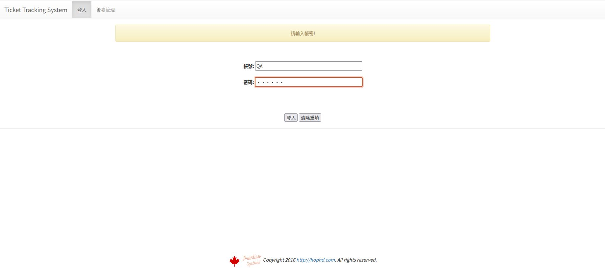
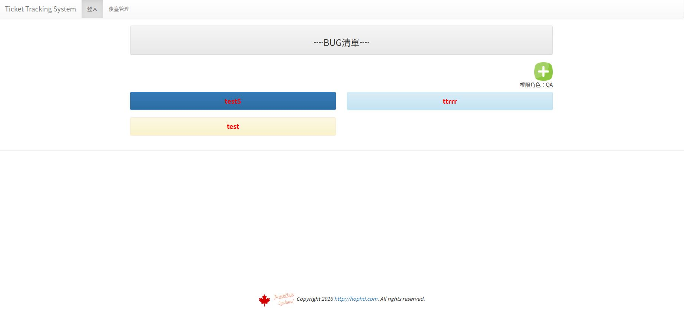
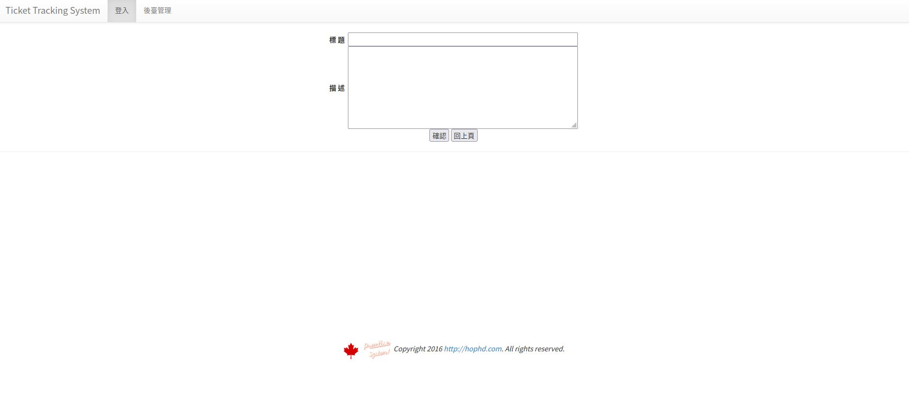
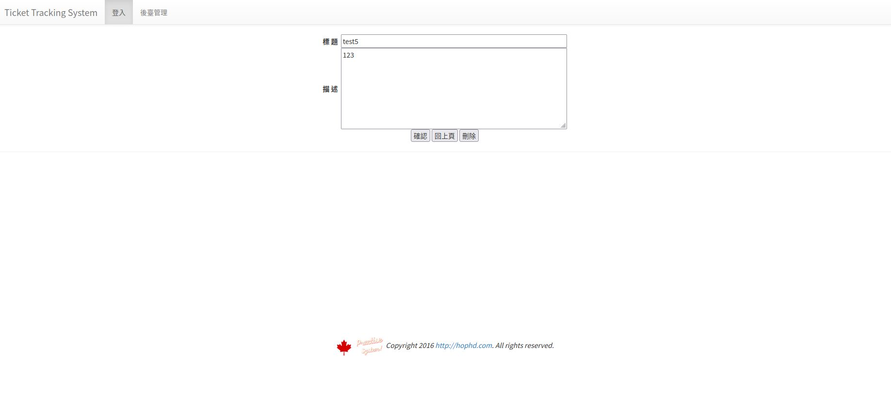
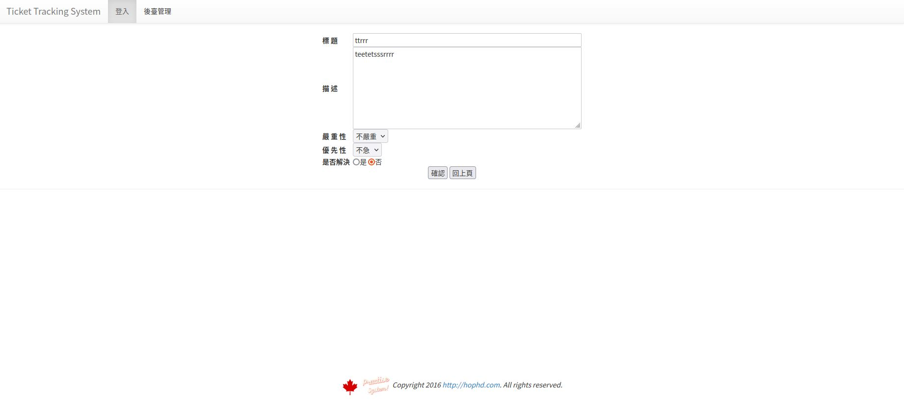
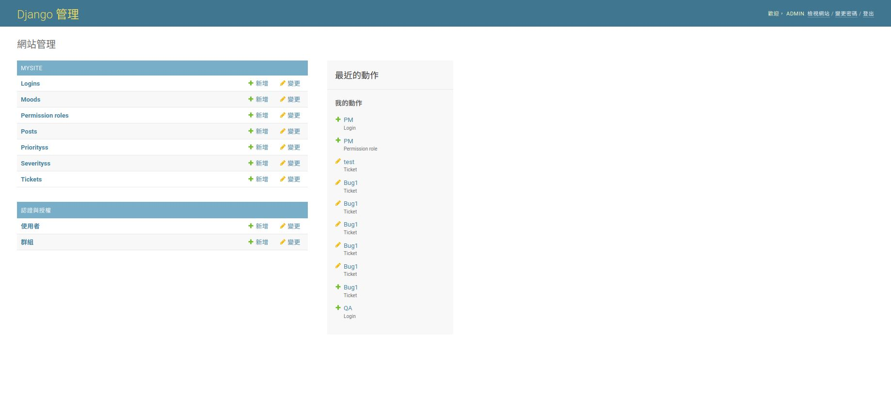

# TicketTest
## task1
##### 1.權限角色分為admin、QA、RD、PM
##### 2.admin管理後台資料庫
##### 3.QA新增刪除修改ticket
##### 4.RD標記以解決
##### 5.PM標記嚴重性以及緊急程度
## task2
##### 使用Python Django
## task3
## models
##### PermissionRole
| 欄位名 | 資料格式|
|  ---- | ----    |
| Role  | CharField|
##### login
| 欄位名 | 資料格式|
|  ---- | ----    |
| user_id  | CharField|
| password  | CharField|
| PermissionRole  | ForeignKey.PermissionRole|
##### Severitys
| 欄位名 | 資料格式|
|  ---- | ----    |
| severity  | CharField|
##### Prioritys
| 欄位名 | 資料格式|
|  ---- | ----    |
| priority  | CharField|
##### ticket
| 欄位名 | 資料格式|
|  ---- | ----    |
| tid  | primary_key.AutoField|
| Summary  | CharField|
| Description  | TextField|
| Severity  | ForeignKey.Severitys|
| Priority  | ForeignKey.Prioritys|
| isResolve  | BooleanField|
## UI
##### 登入頁

##### 列表頁

##### QA新增ticket頁面

##### QA修改刪除ticket頁面

##### RD/PM標記ticket頁面

##### admin後台管理頁面

## task4
##### url:http://127.0.0.1:8000/LoginApi/{parameter}/{parameter}
##### 資料格式:JSON
##### 功能名稱:LoginApi(系統登入)
<table>
<tr>
<th width="120">輸入參考</th>
<th width="120">輸入參數</th>
<th width="120">輸入說明</th>
</tr>
<tr>
<td rowspan=2>
{  
 "LoginID":"QA",
 "PassWord":"123456"
 }
</td>
<td>LoginID</td>
<td>登入帳號</td>
</tr>
<tr>
<td>PassWord</td>
<td>登入密碼</td>
</tr>
</table>

##### 回傳結果
<table>
<tr>
<th width="300">輸出參考</th>
<th width="240">輸出說明</th>
</tr>
<tr>
<td rowspan=2>
{ 
 "result":"登入成功",		      
 "responseTime":"2022-05-30 13:25:00"
}
</td>
<td>result:登入成功/登入失敗</td>
</tr>
<tr>
<td>responseTime:API回應時間</td>
</tr>
</table>
